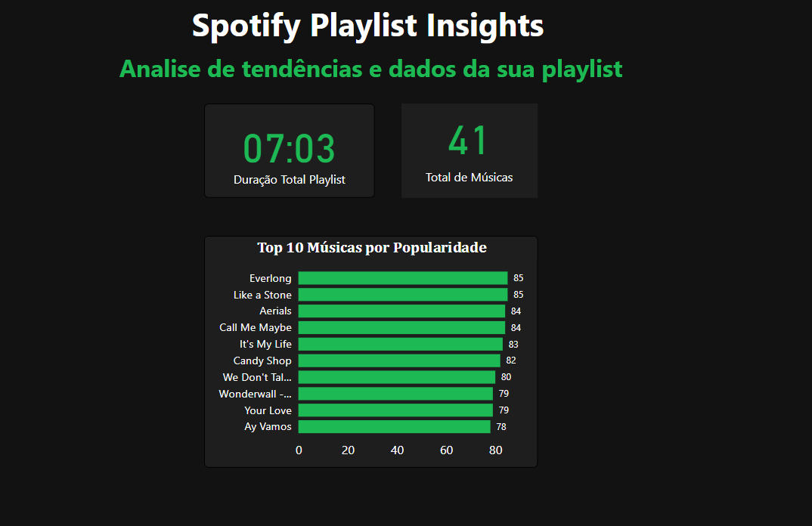

# Spotify Playlist Analyzer 🎧

Projeto de visualização e exploração de dados musicais com base em suas playlists personalizadas usando a API do Spotify, Python e Power BI.

##  Objetivo

Extrair dados da API do Spotify a partir de uma playlist pessoal e apresentar visualmente informações como popularidade das músicas, duração média, distribuição por artistas.

##  Tecnologias Utilizadas

- Python + Spotipy
- Pandas
- Power BI

##  Funcionalidades

- Coleta de dados via API do Spotify
- Exportação dos dados transformados para CSV
- Visualização interativa com Power BI
- Filtros por popularidade e duração
- Análise gráfica de músicas, artistas e álbuns

##  Exemplo de Dashboard



##  Como executar localmente

### Clone o repositório
```bash
git clone https://github.com/AlanBReis/spotify-data-analysis.git
```

### Configure o arquivo .env com suas credenciais da API do Spotify

Para que o script de coleta de dados possa interagir com a API do Spotify, você precisará criar um aplicativo no [Painel de Desenvolvedores Spotify](https://developer.spotify.com/dashboard). Após criar o aplicativo, você receberá um **Client ID** e um **Client Secret**.

Siga estas etapas para configurar o arquivo `.env` localmente:

1.  **Copie o arquivo de exemplo:** Execute o seguinte comando no terminal, na raiz do seu projeto:
```bash
    cp .env.example .env
```
Este comando criará uma cópia do arquivo `.env.example` chamada `.env`. O arquivo `.env.example` já deve conter as variáveis esperadas (por exemplo, `SPOTIPY_CLIENT_ID=` e `SPOTIPY_CLIENT_SECRET=`).

2.  **Edite o arquivo `.env`:** Abra o arquivo `.env` com um editor de texto. Você precisará preencher os valores corretos para as seguintes variáveis, **substituindo o texto `SEU_CLIENT_ID` e `SEU_CLIENT_SECRET` pelos seus valores reais** obtidos no Painel de Desenvolvedores Spotify:

    ```
    SPOTIPY_CLIENT_ID=SEU_CLIENT_ID
    SPOTIPY_CLIENT_SECRET=SEU_CLIENT_SECRET
    SPOTIPY_REDIRECT_URI=http://localhost:8888/callback  # Ou a URI de redirecionamento que você configurou no painel
    ```

    **Importante:**

    * **Não compartilhe seu arquivo `.env` ou suas credenciais diretamente com outras pessoas.**
    * Certifique-se de que o arquivo `.env` esteja listado no seu arquivo `.gitignore` para evitar que suas informações confidenciais sejam enviadas para o repositório Git.

3.  **URI de Redirecionamento:** A `SPOTIPY_REDIRECT_URI` é a URI para a qual o Spotify redirecionará o usuário após a autenticação. Para desenvolvimento local, `http://localhost:8888/callback`


### Instale as dependências
```bash
pip install -r requirements.txt
```

### Modifique para a ID do seu spotify
*Modifique no arquivo fetch_trends.py sua ID*

```bash
playlist_id = "5gJ6V0oZhIR52XOf6ruGw7"
```


### Execute a coleta de dados

```bash
python src/etl/fetch_trends.py
```

Esse script gera um arquivo CSV com os dados da sua playlist.

Visualize os dados no Power BI
Abra o arquivo powerbi-spotify.pbix no Power BI Desktop para explorar o dashboard interativo.


_“Tendências musicais e recomendações personalizadas em um só projeto”_


Desenvolvido por  [Alan Reis](https://www.linkedin.com/in/alanbrreis/) 

## Licença

[MIT](https://choosealicense.com/licenses/mit/)


